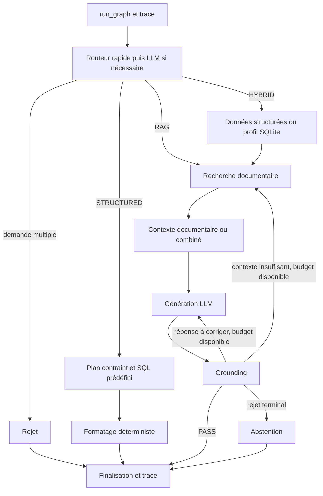

# Architecture et points de modification

Le code applicatif est dans `src/pokemon_rag`. Deux parcours partagent SQLite
et la recherche documentaire, mais n'offrent pas les mêmes garanties.
Lire ensuite uniquement le [guide spécialisé](docs/README.md) de la tâche.

## Points d'entrée

| Entrée | Usage et effets |
| --- | --- |
| `python -m pokemon_rag.graph.graph` | Terminal interactif ; appelle `run_graph`, peut utiliser LM Studio et écrit une trace |
| `graph.graph.run_graph(initial_state)` | Entrée Python du graphe ; état contenant au minimum `question` |
| `python -m pokemon_rag.client.mcp_client` | Une question au terminal, sélection d'un outil par Qwen, exécution MCP, réponse par Qwen |
| `python -m pokemon_rag.mcp.server` | Serveur stdio pour un client MCP ; ce n'est pas un terminal de questions-réponses |
| `scripts/batch/run_questions.py` | Lot de questions via le vrai graphe |
| `benchmarks/benchmark_*.py` | Évaluation des composants ou du graphe avec leurs dépendances réelles |

Ces commandes décrivent les entrées existantes, pas une autorisation d'exécution
par un agent. Les restrictions et prérequis sont dans [les tests](tests/README.md).
Le projet n'expose pas de serveur web ni de commande installée via `[project.scripts]`.

## Parcours du graphe

Les flèches de reprise résument des nœuds dédiés : une nouvelle recherche et une
régénération ont chacune un budget d'une reprise. Les exceptions des nœuds protégés
suivent le chemin `processing_error`, puis la finalisation. Le détail des sorties
est dans le [contrat du graphe](src/pokemon_rag/graph/README.md).

`STRUCTURED` évite la génération et le grounding, mais son routage et son parsing
peuvent appeler le LLM. `HYBRID` utilise notamment le profil `custom_pokedex`
pour les présentations générales ; le tableur n'est pas lu à l'exécution.

## Parcours MCP

`client.mcp_client.ask` démarre un sous-processus serveur, découvre les schémas,
demande à Qwen un nom d'outil et des arguments, exécute cet outil puis demande à
Qwen une réponse. Il sélectionne un seul outil par question : il n'orchestre pas
les trois routes du graphe et n'en applique pas le grounding, les reprises ou les traces.

Le serveur adapte les fonctions `get_*` et `retrieve` au protocole. Il ne passe
ni par `query_structured_data` ni par `run_graph`. Voir les
[limites du client et du serveur](src/pokemon_rag/mcp/README.md).

## Où implémenter un changement

| Comportement | Emplacement principal | Frontière à préserver |
| --- | --- | --- |
| Choisir une route et identifier le Pokémon | `graph/router.py` | Ne pas y exécuter une requête métier ou générer la réponse finale |
| Ajouter une opération structurée, comprendre un jeu ou un niveau | `structured/query_engine.py` | Plan validé et SQL prédéfini ; adapter aussi routeur, formatage et éventuellement outil MCP |
| Construire les contextes, profils, réponses et prompts de génération | `graph/nodes.py` | Le profil SQLite y est actuellement construit ; ne pas y ajouter le nettoyage wiki ou la construction d'index |
| Modifier transitions, budgets, erreurs terminales, finalisation | `graph/graph.py` | Ne pas cacher une politique de reprise dans le retrieval ou un outil MCP |
| Rechercher, fusionner, reranker, reconstruire une section | `rag/retrieval.py` | Retourner des passages ; ni réponse finale ni décision d'abstention |
| Vérifier fidélité et suffisance après génération | `rag/grounding.py` | Retourner un verdict ; le graphe décide de la suite |
| Ajouter une capacité MCP | `mcp/server.py` | Adapter le moteur existant, sans copier le SQL ou le retrieval |
| Choisir un outil et formuler sa réponse | `client/mcp_client.py` | Ne pas attribuer au client les garanties du graphe |
| Cumuler coûts et sérialiser les traces | `observability/metrics.py`, `observability/tracing.py` | Ne pas transformer une erreur d'écriture en échec métier |
| Changer les sources ou leur représentation indexée | `scripts/pokeapi/`, `scripts/pokepedia/` | Préparation explicite, jamais déclenchée par une requête applicative |

## Ressources et configuration

[config.py](src/pokemon_rag/config.py) définit les chemins de SQLite, du tableur,
du corpus et de Chroma, ainsi que les délais LLM utilisés par le graphe, le routeur,
le parseur et le grounding. Les noms de modèles et URL LM Studio restent déclarés
dans les modules appelants ; le client MCP a sa propre configuration.

`pokemon.db` réunit les données PokéAPI et le Pokédex personnalisé. Chroma stocke
les passages documentaires et leurs embeddings. Le retrieval charge les modèles,
le corpus en mémoire et BM25 au premier usage dans chaque processus. Les détails
de construction appartiennent au [guide des scripts](scripts/README.md), les coûts
au [guide de performance](docs/PERFORMANCE.md).

## Limites observées à examiner avant une évolution

- Le routeur intercepte ses erreurs et retourne un fallback RAG global. `route_query`
  ne propage pas son champ `router_error` : toutes les pannes de routage ne deviennent
  donc pas une erreur terminale visible dans le graphe.
- Le serveur MCP expose les fonctions sous-jacentes sans validation du plan complet.
  Les pertes de contraintes du client sont décrites dans son guide, pas corrigées ici.
- Les versions des dépendances ne sont pas verrouillées dans `requirements.txt`.
  La compatibilité du SDK MCP doit être vérifiée dans l'environnement installé.

Ce sont des constats sur le code, pas des changements applicatifs effectués par
la documentation. Les historiques `DEVELOPMENT*.md` décrivent des étapes anciennes
et ne constituent pas la spécification du comportement actuel.
