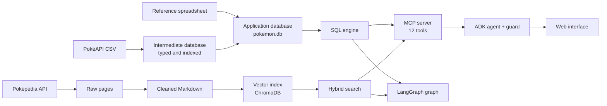

# Pokémon Agent

[](https://github.com/C-H-U-B/pokemon-agent/actions/workflows/ci.yml)

🇫🇷 [Version française](README_FR.md)

A complete data pipeline, from raw sources to a queryable service: two heterogeneous sources are collected, cleaned, modelled and validated, then exposed through a SQL engine and a document search to agents that answer in natural language with a local model.

Everything runs locally: SQLite, ChromaDB and an 8B Qwen model served by LM Studio.

## Live demo

**[Try the agent in the browser](https://pokemon-agent-592924290447.europe-west1.run.app)**: the web interface, hosted on Cloud Run. The local model is replaced there by Gemini 3.8 Flash, called through its API; the data, the tools and the control of tool calls are those of this repository. The interface and the answers are in French.

What to know before asking a question:

- The service stops when nobody uses it and restarts at the next visit. Questions about descriptions only answer once the document base is loaded, about a minute and a half after the page opens (one measurement, 8 October 2026).
- Each question is independent: the agent does not keep the conversation in memory.
- The remote model abstains on some questions the local model answers: it sometimes calls two tools at once, and the failure of the second makes it give up the answer.
- The questions asked are recorded to improve the tool.

The deployment and its settings are described in the [web interface guide](src/pokemon_rag/web/README.md).

## At a glance

| | |
| --- | --- |
| Sources | 29 PokéAPI CSV files, a hand-maintained reference spreadsheet, 1,216 Poképédia pages |
| Relational database | 35 tables, 56 indexes, 8 views; 638,000 move-learning rows across 26 game groups |
| Reference data | 1,025 species, 1,351 Pokémon, 1,579 forms, 937 moves |
| Document index | 36,280 embedded chunks |
| Tests | 1,608 tests, 1,469 of which need no model |
| End-to-end campaign | 41 of 42 questions passed with a local 8-billion-parameter model; the one failure, fixed since, then passed 2 of 2 |

## Data flow



## The data pipeline

### Structured data: PokéAPI and the reference spreadsheet

| Step | Script | What it does |
| --- | --- | --- |
| Collection | `scripts/pokeapi/download_pokeapi.py` | Downloads the CSV files; a file already present is not downloaded again, and writes go through a temporary file |
| Intermediate database | `scripts/pokeapi/build_pokeapi_db.py` | Imports the CSV files with typed columns, creates indexes and label views |
| Application database | `scripts/pokeapi/build_pokemon_db.py` | Reads the spreadsheet, links each row to PokéAPI identifiers and builds the `custom_pokedex` view |

Matching the spreadsheet to PokéAPI is the delicate part: the two sources neither name nor split forms the same way. Each row gets a matching status, and forms without a match are reported rather than hidden.

### Document data: Poképédia

| Step | Script | What it does |
| --- | --- | --- |
| Collection | `scripts/pokepedia/download.py` | Queries the wiki API with a delay between requests; an interrupted run resumes without downloading again |
| Cleaning | `scripts/pokepedia/clean.py` | Converts wiki syntax to Markdown while keeping the section hierarchy |
| Indexing | `scripts/pokepedia/ingest.py` | Splits by section then by size, computes embeddings and loads ChromaDB with deterministic chunk identifiers |

Each chunk keeps the Pokémon, source file and section path it comes from, which lets the search rebuild a full section.

## Data quality

- **Checks at build time.** Each builder ends with a validation that stops the pipeline on an anomaly: database integrity, column types of the largest table, consistency of the matching between the French and English sheets, expected number of species.
- **Tests on real data.** Matching, default forms, evolutions and moves are checked against the built database.
- **Tests on a controlled catalogue.** The SQL logic is tested on small SQLite databases created for each test, with adversarial cases: out-of-order identifiers, null values, ties, missing forms.
- **Isolation.** Light tests fail if they open the project databases or load a model. The SQL engine imports no model client, which a test verifies.
- **Continuous integration.** On every push, GitHub Actions installs the project on a clean machine, runs the static checks and the 1,237 tests that depend on neither local data nor a model.

One data anomaly met along the way shows why these checks matter: the most recent game uses a single learning method, so a search for moves by level returned an empty list for more than 300 Pokémon. Game selection now takes the requested method into account.

## Serving the data

- **SQL engine.** Parameterised functions cover evolutions, moves, types, multi-criteria search and rankings by statistic. Filters, sorts, totals and ties are computed in SQL. The language model never writes SQL: it picks an operation and its arguments.
- **Document search.** Combined lexical and vector search, awareness of section structure, then reranking.
- **MCP server.** Twelve tools expose these functions to any compatible client.
- **HTTP API.** Eleven routes expose the SQL engine without any model. They reuse the functions of the MCP tools: same arguments, same validation.

Three ways of answering a question rely on the same data. The ADK agent and its web interface are the main path. The LangGraph graph and the MCP client are the project's first version, kept for comparison and no longer maintained: the graph covers 7 structured operations against the agent's 12 tools, but it is the only path that checks the faithfulness of a description.

| Path | Principle | Guarantees |
| --- | --- | --- |
| ADK agent and web interface (main) | The model picks the tools, a deterministic check verifies each call | Arguments corrected or call refused, filters the question does not justify removed, answers checked against the lists they draw on, measured context budget |
| LangGraph graph (first version) | Routes between SQL, document search or both | Constrained plan, answer faithfulness check, bounded retries, abstention, traces |
| MCP client (first version) | Minimal hand-written agent loop | Explicit constraints of the question preserved |

## Making a small model reliable

An 8-billion-parameter model often gets arguments wrong: it forgets a filter, invents a bound, replaces a rare name with a more common one. Rather than trusting it, a deterministic check extracts the constraints from the question and compares them with the proposed call before it runs. The answer is checked the same way: when the model omits or denies a row of a list it received in full, the answer is replaced by the list built from the data.

Results of the 31-question campaign, before and after the latest reliability work:

| Measure | Before | After |
| --- | --- | --- |
| Questions passed | 24 | 31 |
| Calls correct as proposed by the model | 15 | 30 |
| Answers dropped for exceeding the context budget | 5 | 0 |

The campaign now has 42 questions, including ordinary words that must not become constraints and lists whose answer is checked. With Qwen served by LM Studio, the model proposes 31 correct calls outright; the check repairs 10 of the other 11 before execution, and 41 questions pass. The answer check replaced one answer, which denied that three of the returned Pokémon were legendary. The failure, an ability formed from the words "type Feu" of the question, was fixed and the question then passed in both runs.

Each cause was isolated before being fixed, telling data errors, test errors and orchestration errors apart. The full account is in the [development history](DEVELOPMENT.md).

## Stack

Python, SQLite, ChromaDB, Sentence Transformers, BM25, CrossEncoder reranking, LangGraph, Google ADK, Model Context Protocol, Gradio, FastAPI, Docker, Ollama, LM Studio, pytest, ruff.

## Running the project

### With Docker, without building anything

The SQLite database and the document index are published in the [repository releases](https://github.com/C-H-U-B/pokemon-agent/releases). Docker is enough: no Python environment to install.

**The API alone, without a model.**

```bash
curl -L -o data/pokemon.db https://github.com/C-H-U-B/pokemon-agent/releases/latest/download/pokemon.db
docker compose up --build api
```

The API is served at `http://localhost:8000/docs`, for example `http://localhost:8000/pokemon/Pikachu/types`. `http://localhost:8000/health` returns a 503 error while the database is missing. In Windows PowerShell, type `curl.exe`: `curl` is a different command there.

**The web interface with Qwen.** The database is downloaded as above. The index is installed once into a Docker volume, then the interface and the model server start together:

```bash
docker compose run --rm --no-deps web python -c "import tarfile, urllib.request; tarfile.open(fileobj=urllib.request.urlopen('https://github.com/C-H-U-B/pokemon-agent/releases/latest/download/chroma_db.tar.gz'), mode='r|gz').extractall('/app', filter='data')"
docker compose up --build web ollama
```

The interface is at `http://localhost:7860`. On first start, Ollama downloads Qwen3-VL 8B (6.1 GB) and the interface waits until it is ready; the two retrieval models (930 MB) are fetched when the page opens. With an NVIDIA card, run `docker compose -f compose.yaml -f compose.gpu.yaml up --build web ollama`.

Configuration this setup was measured on: 10 GB of memory granted to Docker and a 6 GB graphics card. With 8 GB, the model exhausts the memory and its generation falls below one token per second. Allow about fifteen gigabytes of disk. Running without a graphics card has not been measured.

To point the interface at LM Studio or another OpenAI-compatible server, see the [web interface guide](src/pokemon_rag/web/README.md) (in French).

### Locally

Requirements: Python 3.10 or later, and an OpenAI-compatible model server for the paths that call a model. The default is LM Studio on `http://localhost:1234/v1` with `qwen/qwen3-vl-8b` (16,384-token context window); set `LLM_BASE_URL`, `LLM_MODEL` and `LLM_API_KEY` to use Ollama, another host or a remote API.

```bash
pip install -e .
```

Build the data (read [the scripts guide](scripts/README.md), in French, before rebuilding: it replaces existing resources):

```bash
python scripts/pokeapi/download_pokeapi.py
python scripts/pokeapi/build_pokeapi_db.py
python scripts/pokeapi/build_pokemon_db.py
python scripts/pokepedia/download.py
python scripts/pokepedia/clean.py
python scripts/pokepedia/ingest.py
```

Web interface, then the command-line graph:

```bash
python -m pokemon_rag.web.app
python -m pokemon_rag.graph.graph
```

Tests without a model or local data, and static checks:

```bash
python -m pytest -m "not real_data and not llm and not models"
ruff check .
```

## Known limits

- The application database and the document index are published; the intermediate PokéAPI database and the raw corpus still have to be rebuilt to regenerate them.
- On the agent path, structured lists are checked against the data, but nothing checks that a description is faithful to the passages found: it can copy an off-topic record or extrapolate. Only the LangGraph path checks that.
- The answer checks are lexical: they see a missing or distorted name and common denials, not every wording, and lists of more than 30 rows are not checked.
- The agent refuses a question that mixes a description and a structured fact; the two must be asked separately.
- Build steps are launched by hand, in the order above, and rebuild everything.
- Continuous integration does not cover the tests that need the built databases or a model.
- End-to-end measurements depend on a local model; they are rerun manually.

## Documentation

Contributor guides are written in French.

- [Architecture](ARCHITECTURE.md): flows, entry points and module boundaries.
- [Scripts and data](scripts/README.md): preparation pipelines.
- [Structured engine](src/pokemon_rag/structured/README.md), [document search](src/pokemon_rag/rag/README.md), [MCP server](src/pokemon_rag/mcp/README.md), [ADK agent](src/pokemon_rag/agent/README.md), [web interface](src/pokemon_rag/web/README.md).
- [Tests](tests/README.md): which validation to run for a given change.
- [Development history](DEVELOPMENT.md): decisions, problems met and fixes, in chronological order.

## License and credits

The code and the reference spreadsheet are released under the [MIT license](LICENSE). That license does not cover third-party data:

- **PokéAPI**: the game data in the database comes from [PokéAPI](https://github.com/PokeAPI/pokeapi).
- **Pokémon artwork**: the illustrations shown with the answers are official artwork © Nintendo, Game Freak and The Pokémon Company, linked from the public [PokeAPI sprites](https://github.com/PokeAPI/sprites) repository and not redistributed.
- **Poképédia**: the texts of the document corpus and the index derived from them come from [Poképédia](https://www.pokepedia.fr) and remain under the [CC BY-NC-SA 3.0](https://creativecommons.org/licenses/by-nc-sa/3.0/) license: attribution, non-commercial use, share-alike.

Pokémon and related names are trademarks of Nintendo, Game Freak and The Pokémon Company. This project is unofficial and non-commercial.
