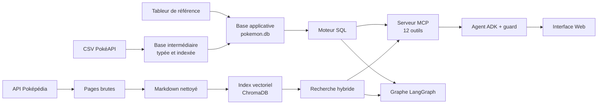

# Pokémon Agent

[](https://github.com/C-H-U-B/pokemon-agent/actions/workflows/ci.yml)

🇬🇧 [English version](README.md)

Une chaîne de données complète, de la source brute au service interrogeable : deux sources hétérogènes sont collectées, nettoyées, modélisées et contrôlées, puis exposées par un moteur SQL et une recherche documentaire à des agents qui répondent en langage naturel avec un modèle local.

Le projet tourne entièrement en local : SQLite, ChromaDB et un modèle Qwen 8B servi par LM Studio.

## En bref

| | |
| --- | --- |
| Sources | 24 fichiers CSV PokéAPI, un tableur de référence maintenu à la main, 1 216 pages Poképédia |
| Base relationnelle | 30 tables, 51 index, 8 vues ; 638 000 lignes d'apprentissage de capacités sur 26 groupes de jeux |
| Référentiel | 1 025 espèces, 1 351 Pokémon, 1 579 formes, 937 capacités |
| Index documentaire | 36 280 fragments vectorisés |
| Tests | 1 288 tests, dont 1 188 sans aucun modèle |
| Campagne de bout en bout | 41 questions sur 42 réussies avec un modèle local de 8 milliards de paramètres ; l'échec, corrigé depuis, a ensuite réussi 2 fois sur 2 |

## Flux de données



## La chaîne de données

### Données structurées : PokéAPI et tableur de référence

| Étape | Script | Ce qu'elle fait |
| --- | --- | --- |
| Collecte | `scripts/pokeapi/download_pokeapi.py` | Télécharge les CSV ; un fichier déjà présent n'est pas retéléchargé, et l'écriture passe par un fichier temporaire |
| Base intermédiaire | `scripts/pokeapi/build_pokeapi_db.py` | Importe les CSV avec des colonnes typées, crée les index et les vues de libellés |
| Base applicative | `scripts/pokeapi/build_pokemon_db.py` | Lit le tableur, relie chaque ligne aux identifiants PokéAPI et produit la vue `custom_pokedex` |

Le rapprochement entre le tableur et PokéAPI est le point délicat : les deux sources ne nomment ni ne découpent les formes de la même façon. Chaque ligne reçoit un statut de rapprochement, et les formes sans correspondance sont signalées plutôt que masquées.

### Données documentaires : Poképédia

| Étape | Script | Ce qu'elle fait |
| --- | --- | --- |
| Collecte | `scripts/pokepedia/download.py` | Interroge l'API du wiki avec un délai entre les requêtes ; une exécution interrompue reprend sans retélécharger |
| Nettoyage | `scripts/pokepedia/clean.py` | Convertit la syntaxe wiki en Markdown en conservant la hiérarchie des sections |
| Indexation | `scripts/pokepedia/ingest.py` | Découpe par section puis par taille, calcule les embeddings et alimente ChromaDB avec des identifiants de fragments déterministes |

Chaque fragment garde le Pokémon, le fichier source et le chemin de section dont il provient, ce qui permet de reconstruire une section complète au moment de la recherche.

## Qualité des données

- **Contrôles à la construction.** Chaque constructeur se termine par une validation qui interrompt la chaîne en cas d'anomalie : intégrité de la base, typage des colonnes de la plus grosse table, cohérence du rapprochement entre les feuilles française et anglaise, nombre d'espèces attendu.
- **Tests sur les données réelles.** Le rapprochement, les formes par défaut, les évolutions et les capacités sont vérifiés sur la base construite.
- **Tests sur catalogue contrôlé.** La logique SQL est testée sur de petites bases SQLite créées pour chaque test, avec des cas adverses : identifiants dans le désordre, valeurs nulles, égalités, formes manquantes.
- **Isolation.** Les tests légers échouent s'ils ouvrent les bases du projet ou chargent un modèle. Le moteur SQL n'importe aucun client de modèle, ce qu'un test vérifie.
- **Intégration continue.** À chaque push, GitHub Actions installe le projet sur une machine vierge, lance le contrôle statique et les 993 tests qui ne dépendent ni des données locales ni d'un modèle.

Une anomalie de données rencontrée en cours de route illustre l'intérêt de ces contrôles : le jeu le plus récent n'utilise qu'une seule méthode d'apprentissage, si bien qu'une recherche de capacités par niveau y renvoyait une liste vide pour plus de 300 Pokémon. La sélection du jeu tient désormais compte de la méthode demandée.

## Exposer les données

- **Moteur SQL.** Des fonctions paramétrées couvrent les évolutions, les capacités, les types, la recherche multicritère et les classements par statistique. Les filtres, les tris, les totaux et les égalités sont calculés en SQL. Le modèle de langage ne produit jamais de SQL : il choisit une opération et ses arguments.
- **Recherche documentaire.** Recherche lexicale et vectorielle combinées, prise en compte de la structure des sections, puis reclassement.
- **Serveur MCP.** Douze outils exposent ces fonctions à n'importe quel client compatible.
- **API HTTP.** Onze routes exposent le moteur SQL sans aucun modèle. Elles réutilisent les fonctions des outils MCP : mêmes arguments, mêmes validations.

Trois façons de répondre à une question s'appuient sur ces mêmes données. L'agent ADK et son interface Web sont le parcours principal. Le graphe LangGraph et le client MCP sont la première version du projet, gardée pour comparaison et non maintenue : le graphe couvre 7 opérations structurées contre les 12 outils de l'agent, mais il est le seul parcours à contrôler la fidélité d'une description.

| Parcours | Principe | Garanties |
| --- | --- | --- |
| Agent ADK et interface Web (principal) | Le modèle choisit les outils, un contrôle déterministe vérifie chaque appel | Arguments corrigés ou appel refusé, filtres non justifiés par la question retirés, réponses confrontées aux listes sur lesquelles elles s'appuient, budget de contexte mesuré |
| Graphe LangGraph (première version) | Routage entre SQL, recherche documentaire ou les deux | Plan contraint, contrôle de fidélité de la réponse, reprises bornées, abstention, traces |
| Client MCP (première version) | Boucle d'agent minimale écrite à la main | Contraintes explicites de la question préservées |

## Fiabiliser un petit modèle

Un modèle de 8 milliards de paramètres se trompe souvent sur les arguments : il oublie un filtre, invente une borne, remplace un nom rare par un nom plus courant. Plutôt que de lui faire confiance, un contrôle déterministe extrait les contraintes de la question et les compare à l'appel proposé avant son exécution. La réponse est contrôlée de la même façon : quand le modèle omet ou nie une ligne d'une liste reçue en entier, la réponse est remplacée par la liste construite depuis les données.

Résultats de la campagne de 31 questions, avant et après les derniers travaux de fiabilité :

| Mesure | Avant | Après |
| --- | --- | --- |
| Questions réussies | 24 | 31 |
| Appels corrects dès la proposition du modèle | 15 | 30 |
| Réponses abandonnées pour dépassement de contexte | 5 | 0 |

La campagne compte désormais 42 questions, dont des mots ordinaires qui ne doivent pas devenir des contraintes et des listes dont la réponse est contrôlée. Avec Qwen servi par LM Studio, le modèle propose 31 appels corrects d'emblée ; le contrôle en corrige 10 des 11 autres avant exécution, et 41 questions passent. Le contrôle des réponses en a remplacé une, qui niait que trois des Pokémon renvoyés soient légendaires. L'échec, un talent formé par les mots « type Feu » de la question, a été corrigé, et la question a ensuite réussi lors des deux exécutions.

Chaque cause a été isolée avant d'être corrigée, en distinguant erreur de données, erreur de test et erreur d'orchestration. Le récit complet est dans [l'historique de développement](DEVELOPMENT_FR.md).

## Technologies

Python, SQLite, ChromaDB, Sentence Transformers, BM25, reclassement par CrossEncoder, LangGraph, Google ADK, Model Context Protocol, Gradio, FastAPI, Docker, Ollama, LM Studio, pytest, ruff.

## Lancer le projet

### Avec Docker, sans rien construire

La base SQLite et l'index documentaire sont publiés dans les [versions du dépôt](https://github.com/C-H-U-B/pokemon-agent/releases). Docker suffit : aucun environnement Python à installer.

**L'API seule, sans modèle.**

```bash
curl -L -o data/pokemon.db https://github.com/C-H-U-B/pokemon-agent/releases/latest/download/pokemon.db
docker compose up --build api
```

L'API répond sur `http://localhost:8000/docs`, par exemple `http://localhost:8000/pokemon/Pikachu/types`. `http://localhost:8000/health` renvoie une erreur 503 tant que la base est absente. Sous Windows PowerShell, écrire `curl.exe` : `curl` y désigne une autre commande.

**L'interface Web avec Qwen.** La base se télécharge comme ci-dessus. L'index s'installe une fois dans un volume Docker, puis l'interface et le serveur de modèle démarrent ensemble :

```bash
docker compose run --rm --no-deps web python -c "import tarfile, urllib.request; tarfile.open(fileobj=urllib.request.urlopen('https://github.com/C-H-U-B/pokemon-agent/releases/latest/download/chroma_db.tar.gz'), mode='r|gz').extractall('/app', filter='data')"
docker compose up --build web ollama
```

L'interface est sur `http://localhost:7860`. Au premier démarrage, Ollama télécharge Qwen3-VL 8B (6,1 Go) et l'interface attend qu'il soit prêt ; les deux modèles de recherche (930 Mo) sont récupérés à l'ouverture de la page. Avec une carte NVIDIA, lancer `docker compose -f compose.yaml -f compose.gpu.yaml up --build web ollama`.

Configuration sur laquelle cet ensemble a été mesuré : 10 Go de mémoire accordés à Docker et une carte graphique de 6 Go. Avec 8 Go, le modèle sature la mémoire et sa génération tombe sous un token par seconde. Compter une quinzaine de gigaoctets de disque. Le fonctionnement sans carte graphique n'a pas été mesuré.

Pour brancher l'interface sur LM Studio ou un autre serveur compatible OpenAI, voir le [guide de l'interface Web](src/pokemon_rag/web/README.md).

### En local

Prérequis : Python 3.10 ou plus récent, et un serveur de modèle compatible OpenAI pour les parcours qui appellent un modèle. Par défaut, LM Studio sur `http://localhost:1234/v1` avec `qwen/qwen3-vl-8b` (fenêtre de contexte de 16 384 tokens) ; `LLM_BASE_URL`, `LLM_MODEL` et `LLM_API_KEY` permettent d'utiliser Ollama, un autre hôte ou une API distante.

```bash
pip install -e .
```

Construire les données (voir [le guide des scripts](scripts/README.md) avant de relancer une construction, qui remplace les ressources existantes) :

```bash
python scripts/pokeapi/download_pokeapi.py
python scripts/pokeapi/build_pokeapi_db.py
python scripts/pokeapi/build_pokemon_db.py
python scripts/pokepedia/download.py
python scripts/pokepedia/clean.py
python scripts/pokepedia/ingest.py
```

Interface Web, puis graphe en ligne de commande :

```bash
python -m pokemon_rag.web.app
python -m pokemon_rag.graph.graph
```

Tests sans modèle ni données locales, et contrôle statique :

```bash
python -m pytest -m "not real_data and not llm and not models"
ruff check .
```

## Limites connues

- La base applicative et l'index documentaire sont publiés ; la base PokéAPI intermédiaire et le corpus brut restent à reconstruire pour les régénérer.
- Sur le parcours de l'agent, les listes structurées sont confrontées aux données, mais rien ne vérifie qu'une description est fidèle aux passages trouvés : elle peut recopier une fiche hors sujet ou extrapoler. Seul le graphe LangGraph contrôle cette fidélité.
- Les contrôles de réponse sont lexicaux : ils voient un nom absent ou déformé et les négations courantes, pas toutes les tournures, et les listes de plus de 30 lignes ne sont pas contrôlées.
- L'agent refuse une question qui mêle une description et un fait structuré ; il faut poser les deux séparément.
- Les étapes de construction se lancent à la main, dans l'ordre ci-dessus, et reconstruisent tout.
- L'intégration continue ne couvre pas les tests qui demandent les bases construites ou un modèle.
- Les mesures de bout en bout dépendent d'un modèle local ; elles sont relancées manuellement.

## Documentation

- [Architecture](ARCHITECTURE.md) : flux, points d'entrée et frontières entre modules.
- [Scripts et données](scripts/README.md) : chaînes de préparation.
- [Moteur structuré](src/pokemon_rag/structured/README.md), [recherche documentaire](src/pokemon_rag/rag/README.md), [serveur MCP](src/pokemon_rag/mcp/README.md), [agent ADK](src/pokemon_rag/agent/README.md), [interface Web](src/pokemon_rag/web/README.md).
- [Tests](tests/README.md) : quelle validation lancer selon la modification.
- [Historique de développement](DEVELOPMENT_FR.md) : décisions, problèmes rencontrés et corrections, dans l'ordre chronologique.

## Licence et crédits

Le code et le tableur de référence sont distribués sous [licence MIT](LICENSE). Cette licence ne couvre pas les données tierces :

- **PokéAPI** : les données de jeu de la base proviennent de [PokéAPI](https://github.com/PokeAPI/pokeapi).
- **Illustrations des Pokémon** : les images affichées avec les réponses sont des illustrations officielles © Nintendo, Game Freak et The Pokémon Company, liées depuis le dépôt public [PokeAPI sprites](https://github.com/PokeAPI/sprites) et non redistribuées.
- **Poképédia** : les textes du corpus documentaire et l'index qui en dérive proviennent de [Poképédia](https://www.pokepedia.fr) et restent sous licence [CC BY-NC-SA 3.0](https://creativecommons.org/licenses/by-nc-sa/3.0/deed.fr) : attribution, pas d'utilisation commerciale, partage dans les mêmes conditions.

Pokémon et les noms associés sont des marques de Nintendo, Game Freak et The Pokémon Company. Ce projet est non officiel et sans but commercial.
